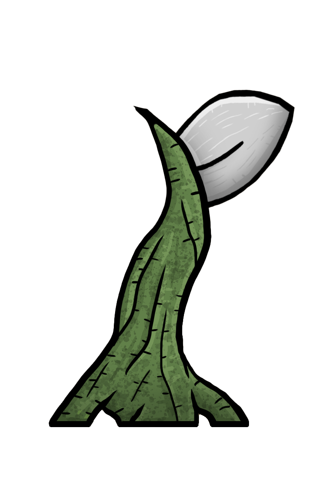
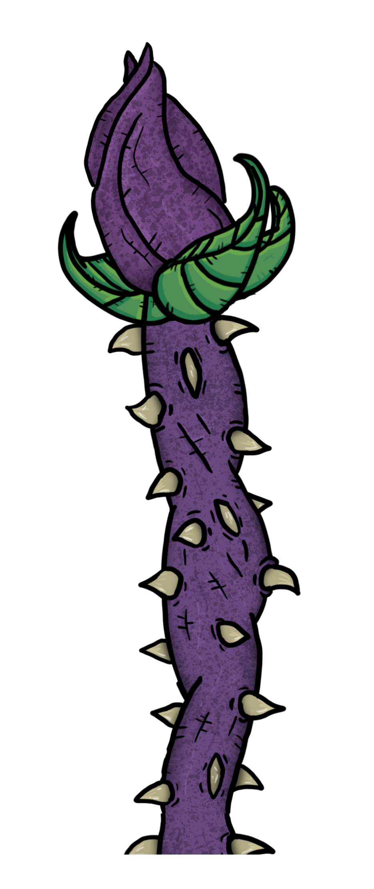
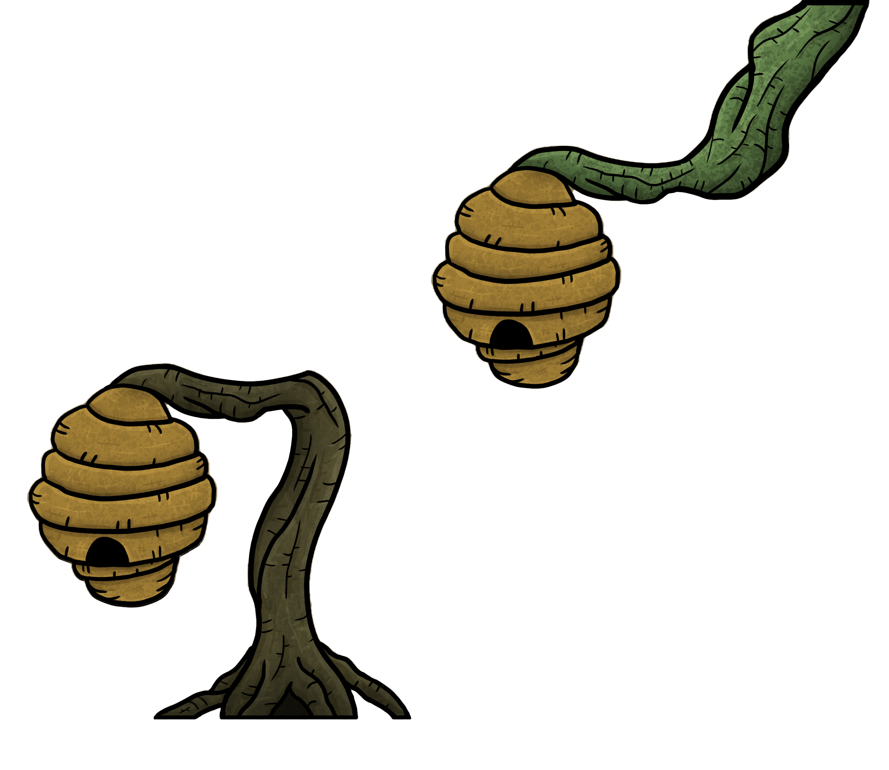
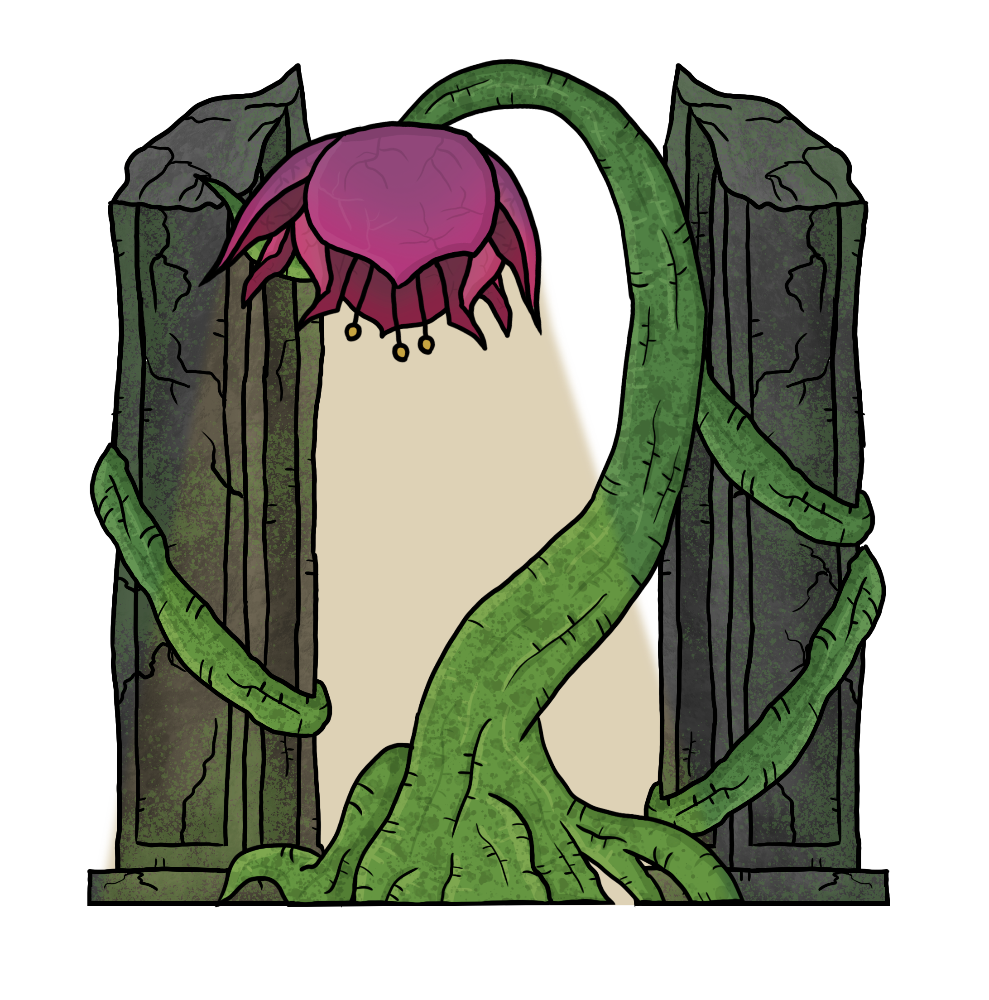

# Mecânicas

O jogo é focado na movimentação e defesa, com o jogador possuindo de 3 de vida inicialmente. É possível encontrar itens nos ambientes, baús ou comprar de vendedores, aumentando sua vitalidade, quantidade de itens carregados, consumíveis e afins, moldando a experiência do jogador.

## Movimentação e Pulo

* Movimentação básica de Oquirá na horizontal, Pulo Simples e Pulo em paredes específicas, além de agarrar para escalar bordas das plataformas e obstáculos.

<figure><figcaption>
Movimentação
</figcaption></figure>

 

<figure><figcaption>
Pulo
</figcaption></figure>

<figure><figcaption>
Pulo na Parede
</figcaption></figure>

## Dash - Impulso

* Possui Cooldown - Impulso horizontal e para cima, o dash também atravessa projéteis específicos, evitando o dano deles.

<figure><figcaption>
É possível dar o Dash horizontalmente e verticalmente, além das diagonais.
</figcaption></figure>

## Escudo

* Item consumível comprado na loja - Cria um bolha ao redor do protagonista, bloqueia ataques e toma dano pelo personagem, a cor do elemento da energia pode ser alterada, para maior eficiência na defesa. O escudo normal ao levar dano diegéticamente ele racha e quebra, se for um escudo melhor ele racha antes de quebrar, e se for superior ele racha algumas vezes, cada vez mais rachado, antes de se quebrar.

<figure><figcaption>
Uma bolha ao redor do personagem que absorve o dano, porém consome 1 barrinha de resistência.
</figcaption></figure>

## Parry - Contra Ataque

<figure><figcaption>
Direcionar o projétil rebatido para a direção desejado, utilizando o cursor do mouse.
</figcaption></figure>

* **Possui Cooldown -** Utilizado para desviar projéteis de inimigos e armadilhas. Não é possível utilizar contra ataques corporais.

<figure><figcaption>
Rebater projéteis para locais de interação.
</figcaption></figure>

Ao dar um contra ataque em um projétil, o jogador repele esse ataque na direção que estiver mirando com o mouse, podendo revidar o ataque para inimigos ou elementos do cenário.&#x20;

Também é possível usar esse contra ataque para baixo, enquanto em cima de projéteis, para conseguir um impulso vertical mais alto que um pulo.&#x20;

Por ser jovem, o protagonista não possui ainda a força física necessária para destruir objetos, muito menos tem o intuito de machucar os inimigos, por conta de seus ideais. Os inimigos são apenas nocauteados ao serem atingidos por projéteis rebatidos, os inimigos se recuperam ao salvar o jogo ou morrer.&#x20;

A cor do rastro do parry de Oquirá é o Branco, por ter sido trazido de volta pela entidade Vida, pois é o escolhido. Assim consegue rebater projéteis de qualquer outro elemento do jogo.

* **Problema -** Acessibilidade para daltonismo;&#x20;
* **Solução -** Utilizar formas ou estilos diferentes para cada partícula das habilidades e cada cor do parry que funciona com tal tipo de ataque. (Ataque normal, Ataque forte e Especial.

## Absorção Elemental

<figure><figcaption>
Ao dar parry, rebater um projétil, o elemento relacionado é absorvido para 1 uso. 
</figcaption></figure>

Após obter o Cajado, Oquirá poderá absorver energias de poços elementais (Planta, Terra, Água, Ar e Fogo, representados abaixo), conseguindo assim interagir com obstáculos para continuar sua jornada.

**Absorveu Natureza (Verde):**

<figure><figcaption>
Planta | Terra | Água | Ar | Fogo
</figcaption></figure>

A cor da energia atual de Oquirá é representada por seus olhos e seu cajado, com partículas de símbolos diferentes o que os tornam mais fáceis de identificar. Oquirá consegue absorver os elementos dos projéteis ao rebater um, porém apenas se domina o elemento ligado ao que foi rebatido.

Mudando a cor de seus olhos para a cor do elemento absorvido (de forma diegética e extradiegética. Também é possível absorver qualquer elemento a qualquer momento, em poços elementais. Mesmo não dominando totalmente o elemento ainda, não será possível utilizar as habilidades do elemento em questão, pois não possui a maestria necessária.

<figure><figcaption>
Poço de Água
</figcaption></figure>

 

<figure><figcaption>
Poço de Ar
</figcaption></figure>

 

<figure><figcaption>
Poço de Fogo
</figcaption></figure>

 

<figure><figcaption>
Poço de Planta
</figcaption></figure>

 

<figure><figcaption>
Poço de Terra
</figcaption></figure>

Exemplo da utilização: Ao dominar apenas o elemento planta, é possível absorver o elemento fogo em um poço elemental, podendo levar a energia absorvida para interagir com uma barreira de planta.

O jogador deverá então carregar o elemento absorvido até a área que será utilizado, sem que de o parry/contra ataque nos projéteis dos inimigos. Pois, se o fizer Oquirá perderá o elemento que foi absorvido, no caso o elemento fogo, irá absorver o elemento do ataque planta, por exemplo.

Portanto, isso traz elementos de gerenciamento do jogo Adventure 1979, tendo que absorver o elemento fogo em um lugar distante, carregar até onde será utilizado, evitando rebater qualquer ataque de planta antes da hora, para utilizá-lo na hora certa, para abrir caminho.

**Absorveu Água (Azul Marinho):**

* Se o jogador domina o elemento poderá utilizar as habilidades abaixo:&#x20;
* Tem fraqueza a ataques de Planta.&#x20;
* **1ª Habilidade -** Possui Cooldown - Apaga áreas específicas que estão pegando fogo, para o jogador acessar um lugar secreto ou abrir atalhos, no caso do backtracking.

**Absorveu Ar (Amarelo):**

* Se o jogador domina o elemento poderá utilizar as habilidades abaixo: ● Tem fraqueza a ataques de Terra&#x20;
* **1ª Habilidade -** Possui Cooldown - Cria Nuvens temporariamente para acessar lugares verticais e antes inacessíveis.&#x20;
* **2ª Habilidade -** Possui Cooldown - Gera um redemoinho que empurra os inimigos e os projéteis em seu caminho.

**Absorveu Fogo (Vermelho):**

* Se o jogador domina o elemento poderá utilizar as habilidades abaixo:&#x20;
* Tem fraqueza a ataques de Água e Terra&#x20;
* &#x20;**1ª Habilidade -** Possui Cooldown - Queima áreas específicas para o jogador acessar um lugar secreto ou abrir atalhos / backtracking.

**Absorveu planta (Verde):**

* Se o jogador domina o elemento poderá utilizar as habilidades abaixo:&#x20;
* Tem fraqueza a ataques de Fogo.&#x20;
* **1ª Habilidade -** Possui Cooldown - É possível colocar em lugares específicos um cogumelo, para pular e alcançar locais que antes não conseguiria.&#x20;
* **2ª habilidade -** Possui Cooldown - Invoca uma raíz protetora, podendo colocar ao seu redor, ou criar uma parede/barreira de raízes, bloqueando ataques de projéteis ou a passagem de inimigos.

**Absorveu Terra (Marrom):**

* Se o jogador domina o elemento poderá utilizar as habilidades abaixo:&#x20;
* Tem fraqueza a ataques de Planta e Água.&#x20;
* **1ª Habilidade -** Possui Cooldown - Gera estruturas em lugares específicos para o jogador acessar novas áreas que não conseguiria antes.&#x20;
* **2ª Habilidade -** Possui Cooldown - Gera barreiras em lugares fixos que bloqueiam ataques.

## Outras Interações

### Folhas de Vitalidade

<figure><figcaption></figcaption></figure>

Item consumível que pode ser coletado pelo cenário ou comprado em lojas, tendo um limite máximo que pode ser carregado, limite esse que pode ser aumentado também. Ao consumir o item, Oquirá recupera uma pétala de vida.

### Fragmentos de Vida

Podem ser encontradas em baús ou completando quests de NPCs. Após serem entregues para a curandeira, Oquirá aumenta o seu número máximo de pétalas de vida em mais uma.

### Portas de espinho feito de Plantas

<figure><figcaption></figcaption></figure>

Passagens bloqueadas por plantas espinhosas. Elas possuem uma flor roxa formando a cabeça e o botão de ativação, ao rebater um projétil nela, a planta encolhe, voltando para a terra, e abrindo caminho para o jogador passar.

### Colmeias

<figure><figcaption></figcaption></figure>

Podem ser derrubadas para chamar atenção e causar distração, impedindo que inimigos avancem, abrindo a possibilidade do jogador avançar por áreas onde existem inimigos resistentes a projéteis.

### Pontos de Save e Viagem Rápida

<figure><figcaption></figcaption></figure>

Durante o jogo o personagem encontrará pontos de salvamento, normalmente localizados em regiões seguras, caso o Oquirá morra, irá retornar para o último ponto de salvamento, perdendo suas essências.&#x20;

Pode ser realizada uma viagem rápida para todos os pontos de salvamento desbloqueados. Sendo necessário gastar uma pequena quantidade de Essências (moeda do jogo) para realizar essa ação.
