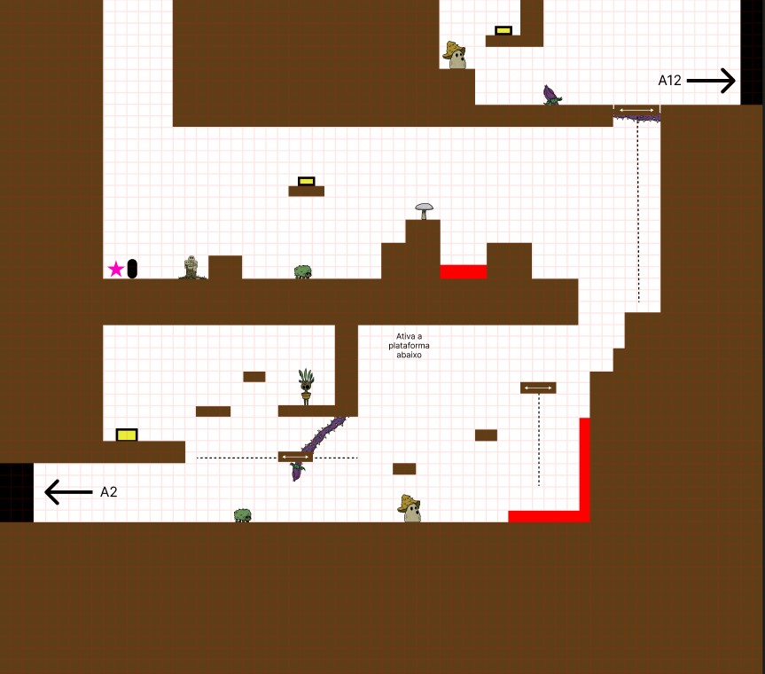

# Progressão e Leveis



<figure><figcaption></figcaption></figure>

Distribuição geral do início do jogo na região da Natureza. Em desenvolvimento a distribuição de lugares de acesso, para próximas regiões e atalhos futuros / backtracking.&#x20;

Durante a progressão nos cenários da Natureza o personagem será introduzido gradativamente as mecânicas básicas, Andar, Pular e se Defender. Avançando, o personagem então encontrará eventualmente&#x20;

O Cajado (apenas o escolhido consegue empunhar ele), desbloqueando assim o Parry e a Absorção Elemental. Continuando a progressão, as próximas mecânicas a se desbloquear são o Dash e Wall Jump, abrindo caminhos que antes eram inacessíveis ao jogador.

<figure><figcaption></figcaption></figure>

 

<figure><figcaption></figcaption></figure>

<figure><figcaption>
A1 - Início do jogo, após o término da primeira cutscene
</figcaption></figure>

<figure><figcaption>
A2
</figcaption></figure>

<figure><figcaption>
A3
</figcaption></figure>

<figure><figcaption>
A4
</figcaption></figure>

<figure><figcaption>
A5
</figcaption></figure>

<figure><figcaption>
A6
</figcaption></figure>

<figure><figcaption>
A7
</figcaption></figure>

<figure><figcaption>
A8
</figcaption></figure>

<figure><figcaption>
A9
</figcaption></figure>

<figure><figcaption>
A10
</figcaption></figure>

<figure><figcaption>
A11
</figcaption></figure>

<figure><figcaption>
A12
</figcaption></figure>

<figure><figcaption>
A13
</figcaption></figure>

<figure><figcaption>
A14
</figcaption></figure>

<figure><figcaption>
A15
</figcaption></figure>

<figure><figcaption>
A16
</figcaption></figure>

<figure><figcaption>
A17
</figcaption></figure>

<figure><figcaption>
A18
</figcaption></figure>

<figure><figcaption>
A19
</figcaption></figure>



