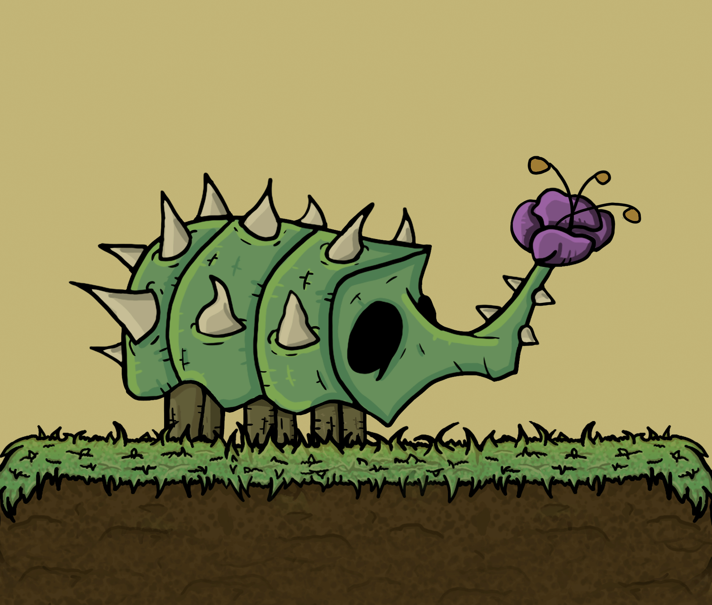
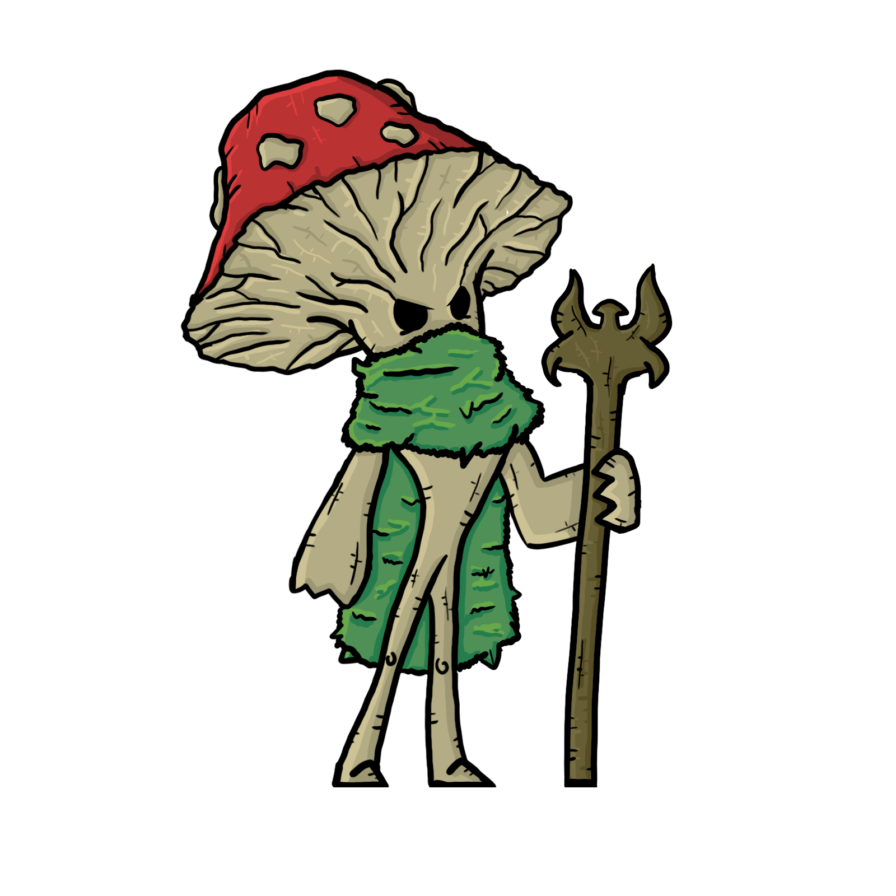

# Inimigos

## Tipos de Inimigos

_Possibilidades de Combinação_

A primeira aparição de qualquer tipo novo de inimigo, ou combinação será vista como um Semi-Boss, muito comum em Souls Like, Hollow Knight etc.

Os inimigos podem ser Artificiais, Naturais Místicos ou não Místicos. Máquinas, Insetos, Animais, Criaturas Elementais: Verde, Marrom, Azul, Amarelo, Vermelho, Cinza.

* Inimigos Normais com Andar;
* Inimigos com Defender;
* Inimigos com Esquivar;
* Inimigos com Perseguir / Investida;
* Inimigos com Voar;
* Inimigos com Planar;
* Inimigos com Saltar;
* Inimigos que Nadam;
* Inimigos com ataque a Distância;
* Inimigos com ataque de proximidade.

## Enemies Animations

### Caubi

<figure><figcaption>
Caubi Idle  - Animation By Manuella Garcia
</figcaption></figure>

 

<figure><figcaption>
Caubi Attack  - Animation By Manuella Garcia
</figcaption></figure>

Possui “2” de Vida.&#x20;

Caubi, seu significado é “Mato verde”. Cheio de energia, e com uma camuflagem natural. Possui presas poderosas, se o encontrar evite contato com sua cabeça, vai te arrancar pedaços. De resto, é bem inofensivo.

### Marani

<figure><figcaption>
Marani Idle  - Art &#x26; Animation By Vinícius Alves
</figcaption></figure>

 

<figure><figcaption>
Marani Attack - Art &#x26; Animation By Vinícius Alves
</figcaption></figure>

Possui “2” de Vida.&#x20;

Cogumelo venenoso. Super territorialista, se o ver, vai cuspir projéteis assim que tiver oportunidade e alcance para isso.

### Itacira

<figure><figcaption>
Itacira Idle - Art &#x26; Animation By Manuella Garcia
</figcaption></figure>

 

<figure><figcaption>
Itacira Walking - Art &#x26; Animation By Manuella Garcia
</figcaption></figure>

 

<figure><figcaption>
Itacira Attacking - Art &#x26; Animation By Manuella Garcia
</figcaption></figure>

Possui “3” de Vida.&#x20;

Itacira, significa “Lâmina Afiada”. Evite seus projéteis rápidos, eles são arremessados em uma parábola utilizando seu caule, itacira vai te cortar todo se o atingir.

### Capotira

<figure><figcaption>
Capotira Idle - Art &#x26; Animation By Manuella Garcia
</figcaption></figure>

 

<figure><figcaption>
Capotira Attack - Art &#x26; Animation By Manuella Garcia
</figcaption></figure>

Possui “3” de Vida.&#x20;

Capotira, “A Flor do Mato”. Seus tiros parecem fofos, e essa é a sua intenção, vão te seguir até deixar caído no chão. Seus projéteis são lançados repetidamente ao seu redor, acima de sua cabeça. Pode ser rebatido, mas boa sorte nisso.

### Ipojuca

<figure><figcaption>
Ipojuca - Idle - Animation By Manuella Garcia
</figcaption></figure>

 

<figure><figcaption>
Ipojuca - Walk - Animation By Rafael Ramos
</figcaption></figure>

 

<figure><figcaption>
Ipojuca - Attack - Animation By Rafael Ramos
</figcaption></figure>

Possui “4” de Vida.&#x20;

Ipojuca, o cogumelo “Pantanoso”. Se o vir, preste atenção onde irá jogar seus projéteis. Se o atingir, cria uma armadilha que diminui a velocidade do Oquirá, porém de perto dá dano corpo a corpo. Não tente rebater-los

### Taciatã

<figure><figcaption>
Taciatã Walk - Animation By Rafael Ramos
</figcaption></figure>

 

<figure><figcaption>
Taciatã Attack - Animation By Rafael Ramos
</figcaption></figure>

Possui “5” de Vida.&#x20;

Taciatã, “Sofrer”. Não sei se o sofrimento é dela ou o seu. Mas se a encontrar, cuidado, não para quieta indo atrás de quem o vir, com sede de sangue querendo compartilhar algo contigo. Suas garras, não tente rebater-las. Ao rebater um projétil nela é possível devolver como um presente, ainda mais rápido e além de poderoso.

### Arui Tupã

<figure><figcaption>
Arui Tupã - 
</figcaption></figure>

 

<figure><figcaption></figcaption></figure>

Possui “4” de Vida.&#x20;

Cuidado ao chegar próximo, sua cauda lança projéteis que te perseguem. Não podem ser rebatidos, portanto priorize ele, caso contrário os projéteis se acumularão.

### Karui

<figure><figcaption>
Karui - Idle - Animation By Rafael Ramos
</figcaption></figure>

 

<figure><figcaption>
Karui - Walk - Animation By Rafael Ramos
</figcaption></figure>

Possui “3” de Vida.&#x20;

Essa não é uma flor que se cheire, vai acabar te dando uma cabeçada ou coisa pior. Se o vir, corre, pois ele vai correr de qualquer jeito.

### Ararandu, O cogumelo profano

<figure><figcaption>
Ararandu, O Cogumelo Profano - Idle - Animation By Rafael Ramos
</figcaption></figure>

Possui “10” de Vida.&#x20;

Ararandu, um dia conhecido como Nãntxu, era um renomado mestre de magia botânica e um sábio conselheiro para guerreiros e magos em todo o reino. Ele dedicava sua vida para estudar os segredos da natureza e a usar sua conexão com o elemento planta para curar, fortalecer e proteger. Por anos, ele compartilhou seu conhecimento com os aprendizes, guiando-os na busca pelo equilíbrio entre os elementos.&#x20;

Contudo, à medida que o equilíbrio entre a vida e a morte começou a desmoronar, Nãntxu viu-se atormentado por visões perturbadoras. Ele testemunhou a crescente interferência do Artificial, uma força sombria que distorcia a ordem natural das coisas, aprisionando a Morte e corrompendo os elementos.&#x20;

Movido por um desejo de manter o equilíbrio, Nãntxu começou a experimentar com magias mais obscuras e proibidas. Ele acreditava que, ao compreender o lado sombrio da magia, poderia encontrar uma maneira de restaurar a harmonia. No entanto, essa busca por poder o levou a descobrir segredos que corromperam sua essência gradualmente. Ao utilizar magias de decomposição para entender o ciclo da vida e da morte, Nãntxu sem avisos abriu uma fenda para o reino do Artificial. A energia escura se infiltrou em sua mente, corrompendo suas intenções nobres.&#x20;

Nãntxu se transformou em Ararandu, o Cogumelo Profano. Agora, ele está preso entre a vida e a morte, uma criatura corrompida que emana energia negra e deseja subjugar a morte em nome do Artificial. Seu cajado, uma vez usado para curar e proteger, agora é uma arma que lança ondas de decomposição, enfraquecendo tudo o que toca.&#x20;

O jogador, como o escolhido para restaurar o equilíbrio, enfrentará Ararandu em um confronto. Durante a batalha, o jogador deve descobrir suas fraquezas, utilizando seus conhecimentos a seu favor. Através da luta, fragmentos da memória de Nãntxu ressurgem, revelando seu trágico destino e a influência do Artificial em sua corrupção.
