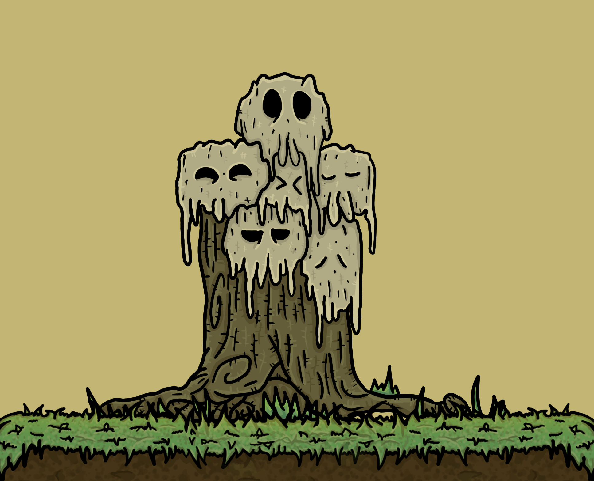
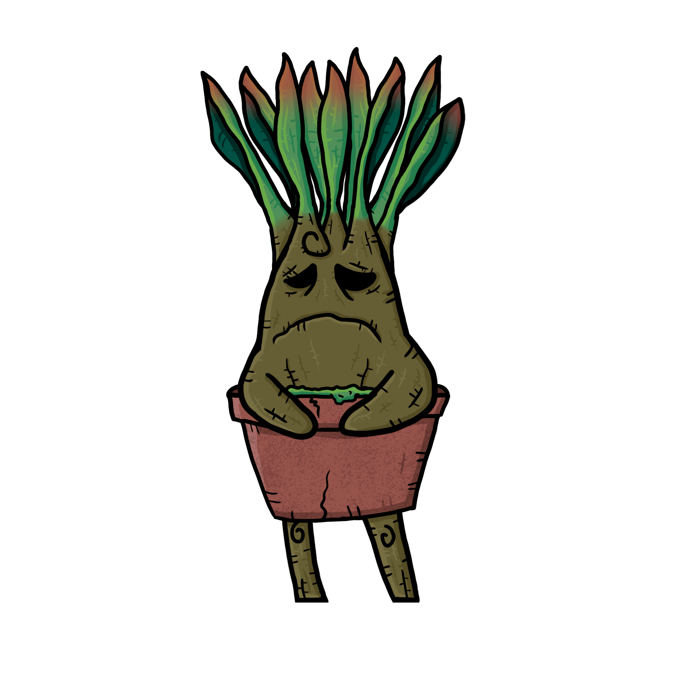
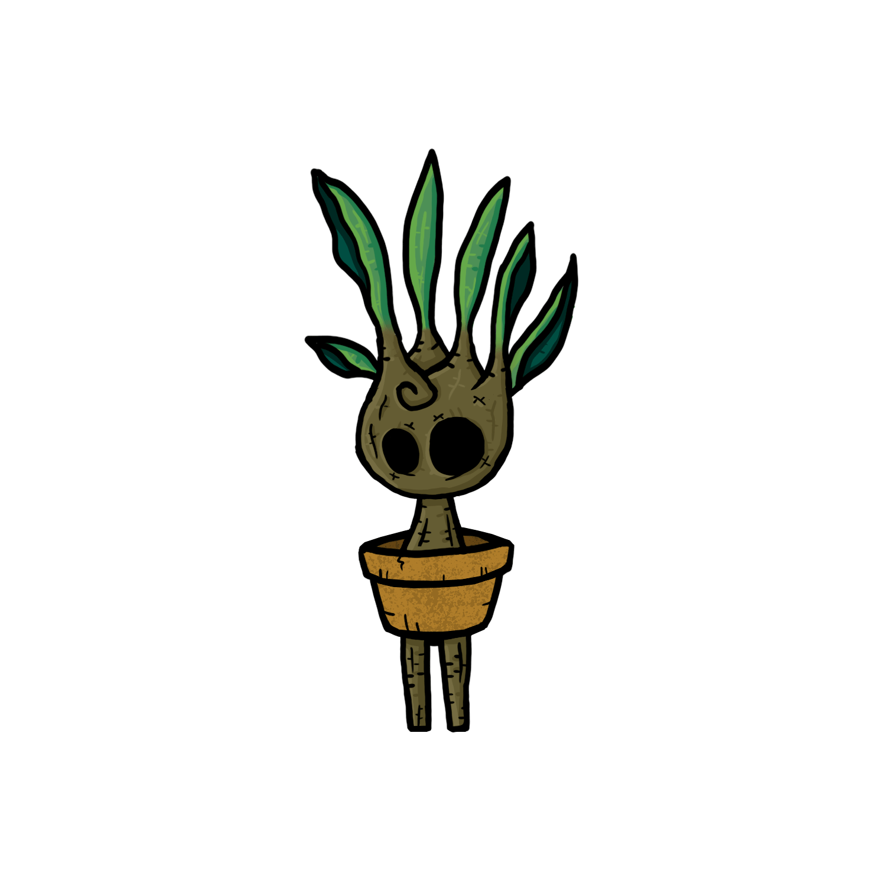
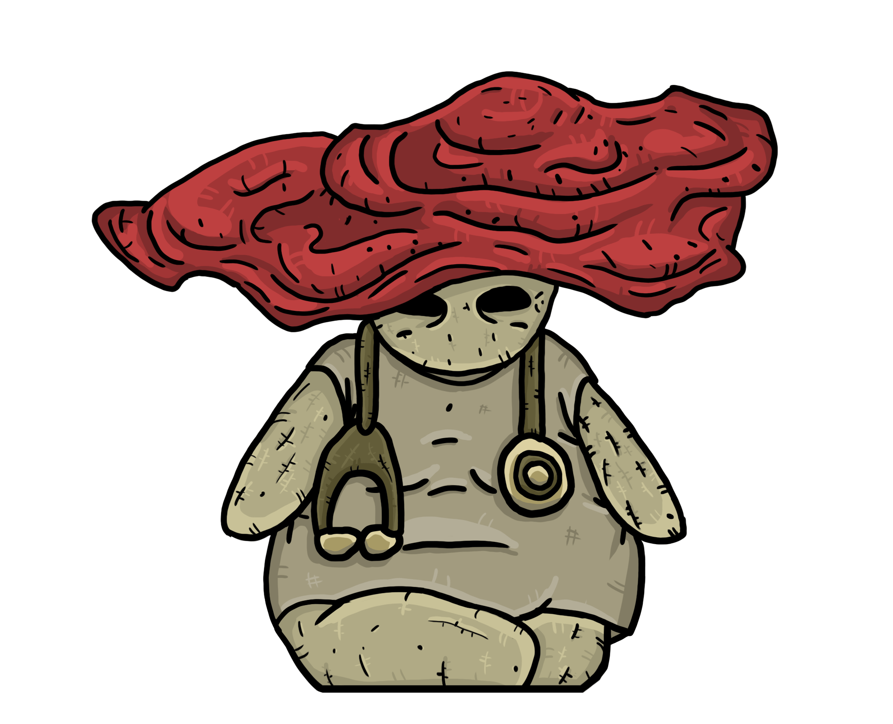

# NPCs

**Entidades**

* Vida - Representada pela cor Branca;
* Morte - Representada pela cor Preta.

**Anciões**

Durante muitas eras foram os representantes e guardiões de cada um dos elementos, os escondendo para que não caísse nas mãos do Artificial.

* Ancião das Plantas - Elemento inicial do personagem;
* Ancião da Terra;
* Ancião das Águas;
* Ancião do Vento - Corrompido - Boss - DESAPARECIDO;
* Ancião do Fogo - Corrompido - Boss - DESAPARECIDO.

**Mentor -** Dica, Tutorial e Treinamento das mecânicas;

**Vendedores - Itens e Power UPs:**

* Vila da Floresta;
* Vila do Lago e Pântano;
* Vila da Montanha;
* Vila do Vulcão;
* Viajante.

**Robô Jardineiro -** O único robô do bem.

**Vidente e Cartomante -** Dicas de progressão.

**Insetos -** Missões, cada um dá um item único se completar sua Quest.

* Inseto Contador de Histórias - Em troca de dinheiro;
* Inseto Assustado - Que Grita;
* Inseto que Dança (referencia a hora de aventura);
* Inseto que Canta;

**Dançarina das Águas -** Quest com item único de recompensa.

## NPCs Animations

### Ubiratã, o Mentor de Oquirá

<figure><figcaption>
Ubiratâ, o Mentor de Oquirá - Animation By Manuella Garcia
</figcaption></figure>

O significado de seu nome é “Madeira Forte”.&#x20;

Ubiratã é um antigo guerreiro que defendeu sua vila de invasões de corrompidos e máquinas por muitos anos. Hoje vive orientando e dando mentoria para os novos guerreiros e aventureiros que surgem e passam pela vida. Pois é sua maneira de alimentar os jovens para que no futuro seja possível se unir contra o artificial.

### Ibiraci, o Viajante

<figure><figcaption>
Ibiraci, o Viajante - Animation By Manuella Garcia
</figcaption></figure>

Ibiraci, significa “Planta com Abelhas”.&#x20;

Hoje um viajante, mas até então seu sonho era ser o escolhido, após crescer ouvindo histórias. Treina direto com suas abelhas, sua tática é a furtividade e atordoamento, principalmente se os inimigos não te ouvem ou não conseguem te ver, pois estão com a cara inchada.&#x20;

Após o aparecimento de Oquirá, o que o levou a procurar outras oportunidades, apesar de ser meio arrogante, é determinado e tem um coração bom, além de amar ajudar as pessoas, ele quer se tornar um herói.

### Ubajara, o vendedor de bens

<figure><figcaption>
Ubajara, o vendedor de bens - Animation By Manuella Garcia
</figcaption></figure>

Ubajara, o “Dono das Armas”.&#x20;

Um integrante de uma longa linhagem de uma Colônia de Cogumelos, ferreiros, guerreiros e negociantes. Vende diversos artigos coletados ao longo de gerações, apesar de sua paixão por essências, espera pela chegada de alguém digno para vender suas melhores mercadorias, pedindo provas de coragem e honra.

### Ualri, o contador de histórias

<figure><figcaption>
Ualri, o contador de histórias - Animation By Manuella Garcia
</figcaption></figure>

Ualri, “aquele que foi transformado em inseto”.&#x20;

Há realmente muito tempo atrás, alguém o amaldiçoou em um inseto, passou por muitos lugares, falou com muitas pessoas em busca de informações de como reverter sua situação. Acabou aceitando os fatos depois de muito tempo, e com tudo o que aprendeu, achou uma forma de conseguir uns trocados.

### Pahy, o sábio

<figure><figcaption>
Pahy - O Sábio
</figcaption></figure>

Pahy é um(a) sábio(a) respeitado(a) pelo seu conhecimento e orientação. Há eras se fundiu ainda vivo a uma rede imemorial de conhecimento, dividindo-se por todos os lados e unindo-se a muitos, aquelas que um dia existiram.&#x20;

Essa rede de conhecimento é o que está entre tudo e todos, e poucos são aqueles que conseguem acessá-la, um deles sendo o Grande Ancião das Plantas. Existindo redes e sistemas diferentes para cada elemento, podendo ser acessado apenas por indivíduos do elemento, exceto o escolhido.

### Mandrágoras

<figure><figcaption>
Mandrágora Mãe
</figcaption></figure>

<figure><figcaption>
Mandragora Filha
</figcaption></figure>

A mãe mandrágora e suas filhas são moradoras que vivem na mata tupã. As mandrágoras possuem sua própria linguagem com base nos gritos, podendo saber outros dialetos ou não.&#x20;

Em sua missão é necessário encontrar todos seus filhos para completar a quest e ganhar itens como recompensa.

### Enarê, o Ancião das Plantas

<figure><figcaption>
Enarê, o Ancião das Plantas
</figcaption></figure>

Enarê, é considerado como se fosse um Deus da tribo. Muitos acham que ele sempre esteve ali, pois está esperando a eras pelo momento certo. Mas na verdade ele participou do conflito da Grande Guerra contra o artificial quando jovem, sendo um dos que ajudaram a unir as tribos e forjar a aliança contra ela.&#x20;

Ele viu o equilíbrio sendo quebrado e o caos se espalhando. Enarê é um dos únicos que consegue acessar a rede ancestral de conhecimento das plantas, assim como compreender Pahy, que faz parte dessa rede a eras.

### Piragã, a curandeira

<figure><figcaption>
Piragâ, A Curandeira
</figcaption></figure>

Piragã, uma das últimas curandeiras da Mata Tupã. Ela é uma das irmãs que estava presente em eventos de muito tempo atrás, contribuindo na guerra ao lado do Ancião verde, porém muitos outros agora vagam sem rumo.&#x20;

Três irmãs, a Piragã, uma que ainda está presente para os necessitados da Mata Tupã. Outra das três irmãs escolheu viver em exílio, devido à experiência traumática que a guerra trouxe a elas. E a última delas cedeu aos mistérios da corrupção, assim como muitos outros.

